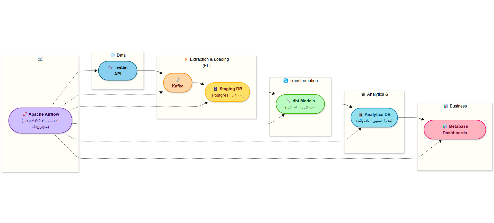
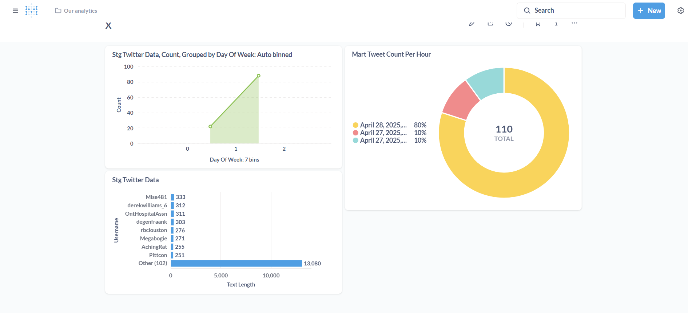
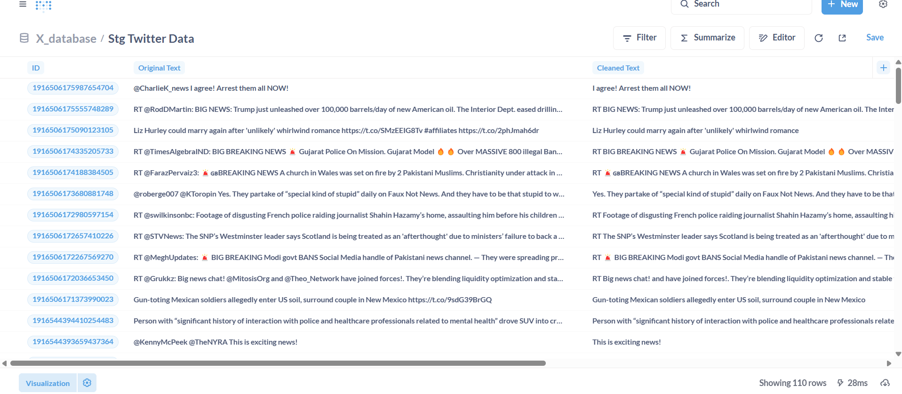

# X (Twitter) Data Pipeline

A scalable and robust data pipeline for extracting, processing, and visualizing Twitter data using Apache Kafka, PostgreSQL, dbt, Apache Airflow, and Metabase. This project streams real-time Twitter data, transforms it into analytics-ready tables, and provides interactive dashboards for insights.

## Table of Contents
- [Overview](#overview)
- [Architecture](#architecture)
- [Prerequisites](#prerequisites)
- [Installation](#installation)
- [Usage](#usage)
- [Directory Structure](#directory-structure)
- [Contributing](#contributing)
- [License](#license)

## Overview

The Twitter Data Pipeline is designed to collect real-time data from the Twitter API, stream it through Apache Kafka, store raw data in a PostgreSQL staging database, transform it using dbt, and visualize the results via Metabase dashboards. Apache Airflow orchestrates the entire workflow, ensuring reliable scheduling and monitoring.

This project is ideal for data engineers and analysts looking to build a modern data pipeline with streaming and batch processing capabilities.

## Architecture

The pipeline follows a modular architecture, as shown in the diagram below:


- **Twitter API**: Provides real-time tweet data.
- **Apache Kafka**: Streams data from the Twitter API to the staging database.
- **PostgreSQL (Staging DB)**: Stores raw data from Kafka.
- **dbt**: Transforms raw data into clean, analytics-ready tables.
- **PostgreSQL (Analytics DB)**: Stores transformed data for querying and analysis.
- **Metabase**: Generates interactive dashboards for data visualization.
- **Apache Airflow**: Schedules and monitors the pipeline tasks.
## Metabase

Below is a sample Metabase dashboard visualizing X posts:  


## Database

The following image showcases the database records visualization:  



## Prerequisites


Before setting up the project, ensure you have the following installed:

- Docker and Docker Compose (v2.0+)
- Git (for cloning the repository)
- Twitter API credentials (Bearer Token or OAuth)
- Basic knowledge of Python, SQL, and data engineering concepts

## Installation

Follow these steps to set up the project locally:

1. **Clone the Repository**:

    ```bash
    git clone https://github.com/your-username/twitter-data-pipeline.git
    cd twitter-data-pipeline
    ```

2. **Set Up Environment Variables**:
   
    SET `twitter_credentials` file in the kafka directory and add the following:

    ```env
    BEARER_TOKEN=your_twitter_bearer_token

    ```

3. **Build and Run Services**:
   
    Run the following command to start all services (Postgres, Kafka, Airflow, Metabase, etc.):

    ```bash
    docker-compose up -d
    ```

4. **Verify Services**:

    - **Airflow Webserver**: [http://localhost:8080](http://localhost:8080) (default credentials: `admin/admin`)
    - **Metabase**: [http://localhost:3000](http://localhost:3000)
    - **Kafka**: Ensure the `kafka:9092` and `zookeeper:2181` services are running.
    - **Postgres**: Connect to `localhost:5432` with credentials `twitter/twitterpass`.

5. **Set Up dbt**:

    The dbt service mounts the `./dbt` directory. Ensure your dbt project is configured in this directory.

    Run dbt commands inside the container:

    ```bash
    docker exec -it dbt bash
    dbt deps
    dbt run
    ```

## Usage

1. **Start the Pipeline**:

    - Log in to Airflow at [http://localhost:8080](http://localhost:8080).
    - Enable the `twitter_data_pipeline` DAG (located in `./airflow/dags`) and trigger it manually or let it run on schedule.

2. **Monitor Kafka**:

    Use a Kafka client (e.g., Kafdrop or Confluent Control Center) to monitor topics and messages. The producer service streams Twitter data to Kafka, and the consumer service writes it to Postgres.

3. **Transform Data with dbt**:

    Run dbt models to transform raw data in the staging database:

    ```bash
    docker exec -it dbt dbt run
    ```

4. **Visualize Data in Metabase**:

    Access Metabase at [http://localhost:3000](http://localhost:3000). Connect to the Postgres `twitter_etl` database and create dashboards for analytics tables.

5. **Monitor Pipeline**:

    - Use Airflow to monitor DAG runs, task statuses, and logs.
    - Check Postgres and Kafka logs for debugging:

    ```bash
    docker logs twitter_etl_postgres
    docker logs kafka
    ```


## Contributing

Contributions are welcome! To contribute:

1. Fork the repository.
2. Create a feature branch:

    ```bash
    git checkout -b feature/your-feature
    ```

3. Make your changes.
4. Commit your changes:

    ```bash
    git commit -m "Add your feature"
    ```

5. Push to the branch:

    ```bash
    git push origin feature/your-feature
    ```

6. Open a Pull Request.

Please include tests and follow the project's coding standards.

## License

This project is licensed under the MIT License. See the [LICENSE](LICENSE) file for details.
